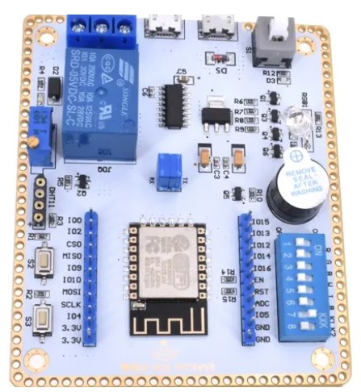

# ESP8266-White-Board-ESPHome
ESPHome YAML for this ESP8266 "White Board" SDK purchased from AliExpress.com

Note this White Board uses an embedded ESP8266MOD module that has 4M of flash memory.  There is an older version of this board that uses an ESP8266 on an ESP-201 daughter board.  The older version has only 512K of flash memory and will not work with this ESPHome file.

This is the one with the embedded ESP8266MOD that works with this repository.

